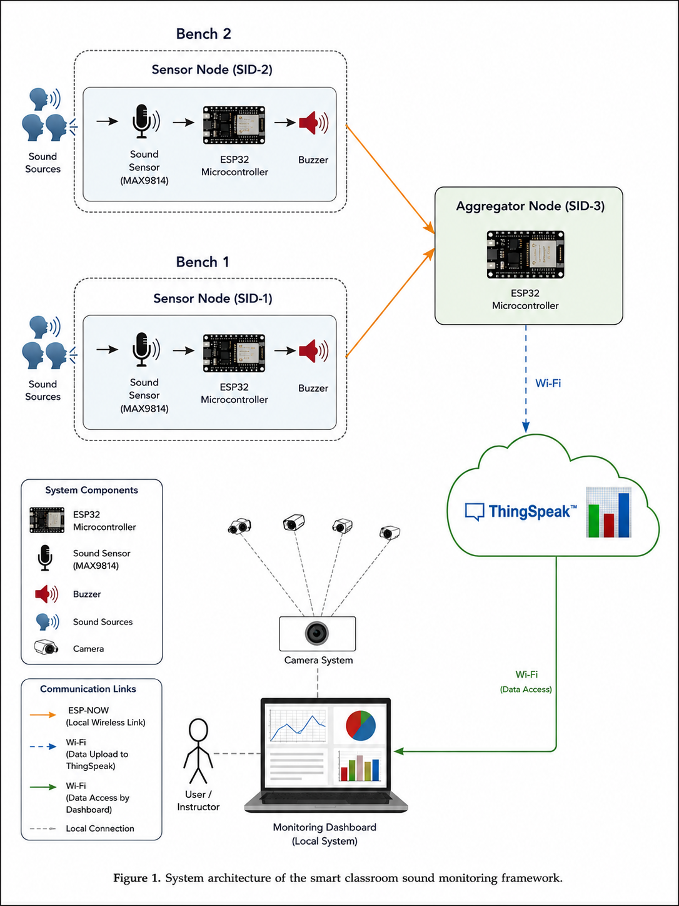
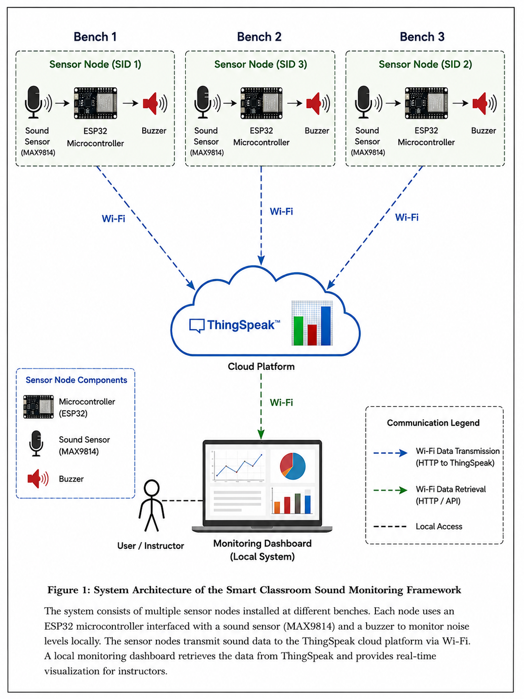

## Diagram

## Architecture 1: Aggregator-Based Centralized Architecture

  

This architecture represents a centralized communication and data aggregation model. Multiple ESP32-based classroom monitoring nodes collect classroom sound/noise data and send their readings to a central aggregator module/server through wireless communication. The aggregator processes, filters, and combines data from all nodes before collectively uploading it to the ThinkSpeak cloud platform. The frontend dashboard then fetches the processed data from ThinkSpeak APIs for real-time monitoring, analytics, and visualization. This architecture improves centralized data management and reduces direct cloud communication from individual nodes.

---

## Architecture 2: Direct Cloud Communication Architecture

  

This architecture represents a decentralized communication model where each ESP32-based classroom monitoring node independently collects classroom sound/noise data and directly sends the readings to its respective ThinkSpeak cloud channel over Wi-Fi. The frontend dashboard retrieves real-time data directly from the ThinkSpeak cloud using APIs for visualization, analytics, and classroom monitoring. In this approach, every node communicates with the cloud individually without any intermediate processing layer.

public url of analytics : https://thingspeak.mathworks.com/channels/3351889

some screenshots of the analytics dashboard on thingspeak :

results on website : 

some more results :

-----

how to run : cd app && streamlit run app.py

----

alternative architecture 

capable of :

- detecting noise levels in real-time using an ESP32 microcontroller and a sound sensor.
- sending the data to a cloud platform (ThingSpeak) for storage and analysis.
- providing a web interface for users to visualize the noise levels and receive alerts when thresholds are exceeded.
and the best part is that it can be easily deployed on a local server or cloud platform, making it accessible from anywhere with an internet connection.
- the system can be customized to fit specific use cases, such as monitoring noise levels in a home, office, or public space.
- the system can be integrated with other IoT devices and platforms for enhanced functionality, such as smart home automation or environmental monitoring.
- the system can be used for various applications, such as noise pollution monitoring, workplace safety, and home security.
- the system can be easily maintained and updated, allowing for continuous improvement and adaptation to changing needs and technologies.
- the system can be used for educational purposes, providing a hands-on learning experience for students and hobbyists interested in IoT and environmental monitoring.
